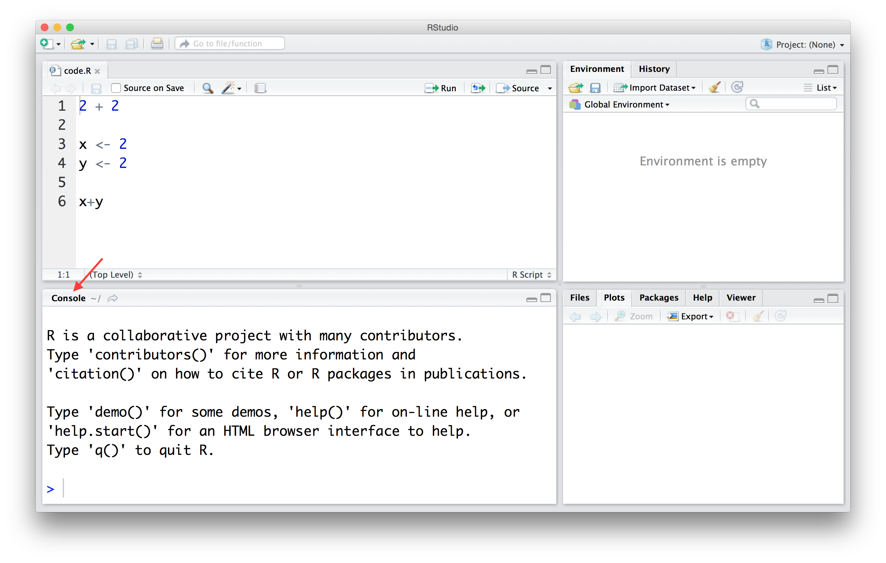

## What is the R programming language? 
Although R is technically a programming language, it was 
developed specifically for analyzing data. We will therefore 
teach R in the context of analyzing data rather than as one 
would teach a programming language. As a result, we will be 
learning some data analysis concepts along the way.

For anyone with limited programming experience, here are some 
useful R programming courses to help you getting started with R: 

* DataCamp's [R course](https://www.datacamp.com/courses/free-introduction-to-r)
* edX's [Introduction to R Programming](https://www.edx.org/course/introduction-r-programming-microsoft-dat204x-0)

Below we include a broader list of resources for learning R.

## Installing R

The first step is to install R. You can download and install R from
the [Comprehensive R Archive Network](https://cran.r-project.org/)
(CRAN). It is relatively straightforward, but if you need further help
you can try the following resources: 

* [Installing R on Windows](https://github.com/genomicsclass/windows#installing-r) 
* [Installing R on Mac](http://youtu.be/Icawuhf0Yqo)
* [Installing R on Ubuntu](http://cran.r-project.org/bin/linux/ubuntu/README)

## Installing RStudio

The next step is to install [RStudio](https://www.rstudio.com/home/), 
a program for viewing and running R scripts. Technically you can 
run all the code shown here without installing RStudio, but we highly 
recommend this integrated development environment (IDE). Instructions are 
[here](http://www.rstudio.com/products/rstudio/download/) and for
Windows we have special
[instructions](https://github.com/genomicsclass/windows). 

RStudio is especially useful because it includes a console, 
syntax-highlighting editor and tools for plotting, history, 
debugging and workspace management. 

## The R Console

Now that you have download and installed R you are ready to 
start working with data. Whichever approach you are using 
to interact with R, we recommend RStudio, you should 
identify the console. 




#### Your turn

Open the R Markdown file (ends in `.Rmd` in RStudio). If you have
successfully installed R and RStudio, you should be able to 
follow along with the rest of this tutorial by running code
yourself.  

When you type a line of code into the console and hit enter 
the command gets *executed*. For example, try typing:

```{r}
2+2
```

We can also assign values to variables. Try the following

```{r}
x <- 2
y <- 2
x + y
```

## The R ecosystem

When you download R from [CRAN](https://cran.r-project.org) 
you get what we call *base* R. This includes several 
*functions* that are considered fundamental for data 
analysis. It also includes several example datasets. 
These datasets are particularly useful as examples 
when we are learning to use the available functions. 
You can see all the available dataset by executing 
the function `data()` like this:

```{r,eval=FALSE}
data()
```

Because in R functions are objects, we need the two 
parenthesis to let R know that we want the function 
to be executed as opposed to showing us the code for 
the function. Type the following and note the difference:

```{r,eval=FALSE}
data
```

#### Explore a data set in R

To see an example of functions at work, we will use the
`faithful` dataset (Old Faithful Geyser Data). To view any
data set that has been loaded in R, you can just type
the name of the data set. Be careful if you have a 
large data set as this will print all rows and all 
columns in the R console. 

```{r, eval=FALSE}
faithful
```

We see there are two columns titled `eruptions` and
`waiting` and 272 observations. 

Alternatively, if you want to see just the first 
few rows of the data set, use the `head()` (or `tail()`)
function, which returns the first few (or last) rows. 

```{r}
head(faithful)
tail(faithful)
```

If you want to see a summary of the structure 
(or dimension) of the data set, you can use 
the `str()` (or `dim()`) function. 

```{r}
str(faithful)
dim(faithful)
```
Here we see that this object is a `data.frame`. 
These are one of the most widely used data types in R. 
They are particularly useful for storing tables. 

Finally, you can use the `View()` function to
open a "spreadsheet-style" data viewer of the 
data set. 

```{r, eval=FALSE}
View(faithful)
```

#### Extracting elements in a data frame 

To extract specific elements in a `data.frame`
in R, we can use the `[` symbol: 

```{r}
## extract element in 5th row and 2nd column
faithful[5,2]

## extract element in 10th row and 1st column
faithful[10,1]
```


#### Extracting entire columns

There are two ways to extract an entire column 
from a `data.frame`. 

The first way is to use the `[` symbol: 
```{r, eval=FALSE}
faithful[,1]
```
Note, we do not write a number before the comma, 
which tells R to return all the rows in the 
first column. This returns a vector.  

Alternatively, to extract columns by specifying the 
name of the column in the `data.frame` we use 
the `$` character like this:

```{r, eval=FALSE}
faithful$eruptions
```
This also returns a vector. 

To return a list of the column names, we use the 
`colnames()` function
```{r}
colnames(faithful)
```

Finally, we access elements from a 
vector using the `[` symbol:

```{r}
faithful$eruptions[2]
```

#### Quick Review of Vectors

Vector are a sequence of data elements of the same type. 
Many of the operations used to analyze data are applied to vectors. 
In R vectors can be numeric, characters or logical. 

The most basic way to create a vector is with the function `c()`
```{r}
x <- c(1,2,3,4,5)
```

Two very common ways of generating vectors are 
using `:` (called the colon operator) or 
the `seq()` function:

```{r}
x <- 1:5
x

x <- seq(1,5)
x
```

Vectors can have names

```{r}
names(x) <- letters[1:5]
x
```


#### Coercion

Vectors need to be homogenous. But when R is instructed to 
create a vector of different types, it does not give an error. 
Instead it tries to *coerce* values to be the same. 
Here is an example of coercing a list of numbers 
(heights in inches) with a character string (height in 
feet and inches):

```{r}
height <- c(60, 59, 55, "5'5", 70)
height
```

Note that no warning or error was given. It simply changed 
everything to a character. This is important to know 
because sometimes we make a mistake in entering data 
and receive no error message.


#### Using a base function in R

To illustrate the function `plot()` (one of 
the base functions in R), we can plot 
the "eruption time" and "waiting time to 
next eruption" like this:

```{r}
plot(x = faithful$eruptions, y = faithful$waiting)
```

## Getting help

A key feature you need to know about R is that you 
can get help for a function using `help` or `?`, like this:
```{r,eval=FALSE}
?plot
help("plot")
```

These pages are quite detailed and also include 
examples at the end. 


#### Your turn

Add labels to the x and y axes. Use the help file 
to read about how to do that. 

```{r}
## Provide your code here

```

Generally speaking, R's base functionality is bare bones. 
In reality, applications of statistics and data analysis
can be quite broad. Therefore, the statistical toolbox 
developed by R developers and users is extensive. Most 
users need only a small fraction of all the available 
functionality. Therefore, a better approach is to make 
specific functionality available *on demand*. 
R does this using *packages*, also called *libraries*. 

Some packages are considered popular enough that they are 
included with the base download. For example, the software 
implementing the method of survival analysis are in the 
`survival` package. To bring that those functions in the 
`survival` R package to your current R session we type:

```{r,eval=FALSE}
library(survival)
```

However, CRAN has over 4,000 packages that are not
included in the base installation. You can install 
these using the `install.packages()` function. 

## Installing Packages

The first R command we will run is `install.packages()`. 
R only includes a basic set of functions. It can do much 
more than this, but not everybody needs
everything so we instead make some functions available via
packages. Many of these functions are stored in CRAN where
packages are vetted: they are checked for common errors 
and they must have a dedicated maintainer. There are other 
repositories, some with more vetting, such as [Bioconductor](http://www.bioconductor.org), and no vetting, 
such as GitHub. You can easily install CRAN packages 
from within R if you know the name of the packages. 
As an example, we are going to install the package `dplyr` 
which we use in our first data analysis examples: 

```{r,eval=FALSE}
install.packages("dplyr")
```

We will learn about the `dplyr` R package later on today. 
For now, all we need to know is that 
we can then load the package into our R session 
using the `library` function:

```{r, message=FALSE}
library(dplyr)
```

From now on you will see that we sometimes load 
packages without installing them. This is because 
once you install the package, it remains in place and 
only needs to be loaded with `library`. If you try 
to load a package and get an error, it probably 
means you need to install it first.


## Comments
The hash character represents comments, so text following these
characters is not interpreted:

```{r}
##This is just a comment
##Note the comment is inside of the three "ticks" on the top and bottom
##The "ticks" tell R this is a code chunk. 
##Anything inside of a code chunk be evaulated, unless it is commented out
```


## Paths and the Working Directory

When you are working in R it is useful to know 
your *working directory*. This is the directory 
or folder in which R will save or look for files 
by default. You can see your working directory 
by typing:

```{r, eval=FALSE}
getwd()
```

You can also change your working directory using 
the function `setwd()`. Or you can change it 
through RStudio by clicking on "Session" in 
the top menu bar. 

The functions that read and write files 
(there are several in R) assume you mean to look 
for files or write files in the working directory. 
Our recommended approach for beginners will have 
you reading and writing to the working directory. 
However, you can also type the 
[full path](http://www.computerhope.com/jargon/a/absopath.htm), 
which will work independently of the working directory.


## Projects in RStudio

We find that the simplest way to organize yourself 
is to start a Project in RStudio 

#### Your turn 

In the top menu bar, click on "File" and "New Project". 
When creating the project, you will select a folder to 
be associated with it. You can then download all your 
data into this folder. Your working directory will 
be this folder.

## Resources

Apart from the two courses lister above, there are many resources to help you 
familiarize yourself with the basics of programming and R syntax.  One such tutorial is the [swirl](http://swirlstats.com/) tutorial, which teaches you R programming interactively, at your own pace and in the R console. Once you have R installed, you can install `swirl` and run it the following way: 

```{r, eval=FALSE}
install.packages("swirl")
library(swirl)
swirl()
```

[try R](http://tryr.codeschool.com/) interactive class from Code School. 

There are also many open and free resources and reference
guides for R. Two examples are:

* [Quick-R](http://www.statmethods.net/): a quick online reference for data input, basic statistics and plots
* R reference card [PDF](https://cran.r-project.org/doc/contrib/Short-refcard.pdf) by Tom Short 

#### More advanced R Resources (from Roger Peng)

Available from CRAN (http://cran.r-project.org)

-   An Introduction to R
-   Writing R Extensions
-   R Data Import/Export
-   R Installation and Administration (mostly for building R from sources)
-   R Internals (not for the faint of heart)

#### Some Useful Books on R

Standard texts

-   Chambers (2008). *Software for Data Analysis*, Springer.
-   Chambers (1998). *Programming with Data*, Springer.
-   Murrell (2005). *R Graphics*, Chapman & Hall/CRC Press.

Other resources

-   Springer has a series of books called *Use R!*.
-   A longer list of books is at [http://www.r-project.org/doc/bib/R-books.html](http://www.r-project.org/doc/bib/R-books.html)
