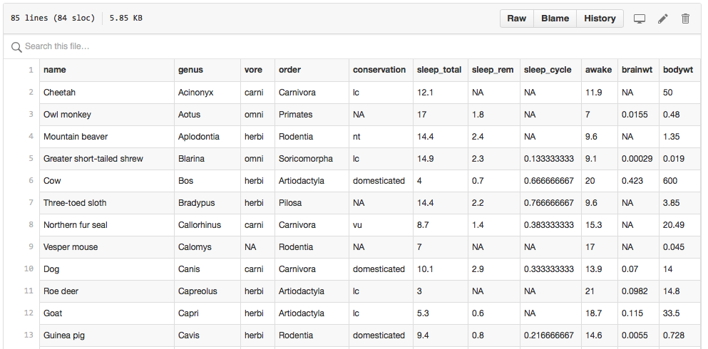

Usually the first step in data analysis is getting 
the data in a form that permits analysis, for example,
importing the data into the R environment. 

Small datasets such as the one used as an
example here are typically stored as Excel files. 
Although there are R packages designed to read Excel 
(`.xls`) format, you generally want to avoid this and 
save files as comma delimited (Comma-Separated
Value/CSV or `.csv`) or tab delimited 
(Tab-Separated Value/TSV/TXT e.g. `.txt`) files. 
These plain-text formats are often easier for 
sharing, as commercial software is not required for 
viewing or working with the data.

We will start with a comma delimited file called 
`msleep_ggplot2.csv` which stands for "mammals sleep".
This data set contains the sleeptimes and weights 
for a set of mammals and is [available online here](https://github.com/genomicsclass/dagdata/tree/master/inst/extdata). 
This data set contains 83 rows and 11 variables.


## Base functions to read in data into R

The are several functions in base R that are
available for reading data. A Google search of 
"how do I import data into R?" gets us to the 
function `read.table()`. 

```{r,eval=FALSE}
?read.table
```

From the help file we see that we need that we need 

> the name of the file which the data are to be read from. Each row of the table appears as one line of the file. If it does not contain an absolute path, the file name is relative to the current working directory, `getwd()`. 

Other base functions to read data into R includ `read.csv()` and
`read.delim()`. 

#### Paths and the Working Directory

In the first tutorial, we learned about identifying 
your *working directory*. This is the directory or folder 
in which R will save or look for files by default. 
As a reminder, you can see your working directory by typing:

```{r, eval=FALSE}
getwd()
```

You can also change your working directory using 
the function `setwd()`. Or you can change it through 
RStudio by clicking on "Session". 

Alternatively, if you have started a new Project in 
RStudio, then you can download all your data into this
folder and your working directory will be this folder. 

## Two main options to load data using base R

#### Option 1: Download file with your browser to your working directory

You can navigate to the file `msleep_ggplot2.csv` [available online](https://github.com/genomicsclass/dagdata/tree/master/inst/extdata). 
If you navigate to the file, you need to click on *Raw* on the
upper right hand corner of the data and then use your browser's "Save
As" function to ensure that the downloaded file is in a CSV
format. Some browsers add an extra suffix to your file name by
default. You do not want this. You want your file to be named
`msleep_ggplot2.csv`. 



Once you have this file in your working directory, then you 
can simply read it in like this:

```{r,eval=FALSE}
msleep <- read.csv("msleep_ggplot2.csv")
```

If you did not receive any message, then you probably 
read in the file successfully.


#### Option 2: Read file on web from within R 

Many data sets are stored online. You can actually read 
these files directly to your R session in the following way:

```{r,message=FALSE}
filename <- "https://raw.githubusercontent.com/genomicsclass/dagdata/master/inst/extdata/msleep_ggplot2.csv"
msleep <- read.csv(filename)
```

**Note**: to make assignments in R, we use `<-`. 
We can also use the equal sign `=` although here we try 
to stick to `<-` to make it very clear it is an 
assignment and not logical statement.

We also note that we have put the content of what comes out 
of `read.csv` into an *object*. We picked the object name `msleep`. 

So what is `msleep` exactly? 

#### Your turn 
Use the functions we learned in the Introduction to R and RStudio 
tutorial to explore `msleep` data set. 
(e.g. `head()`, `View()`, `str()`, `dim()`)

```{r}
## Provide your code here

```

Here we see that this object is a `data.frame`. 
These are one of the most widely used data types in R. 
They are particularly useful for storing tables. 


 